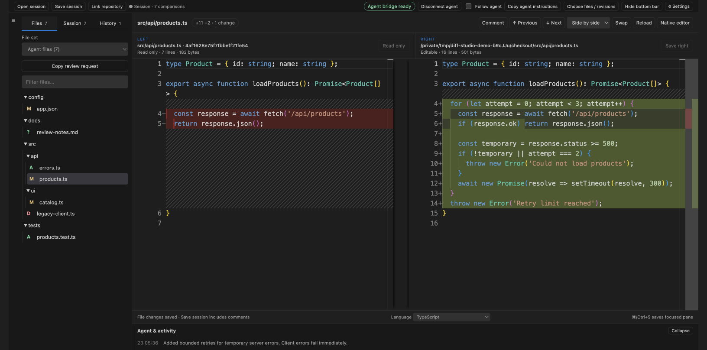
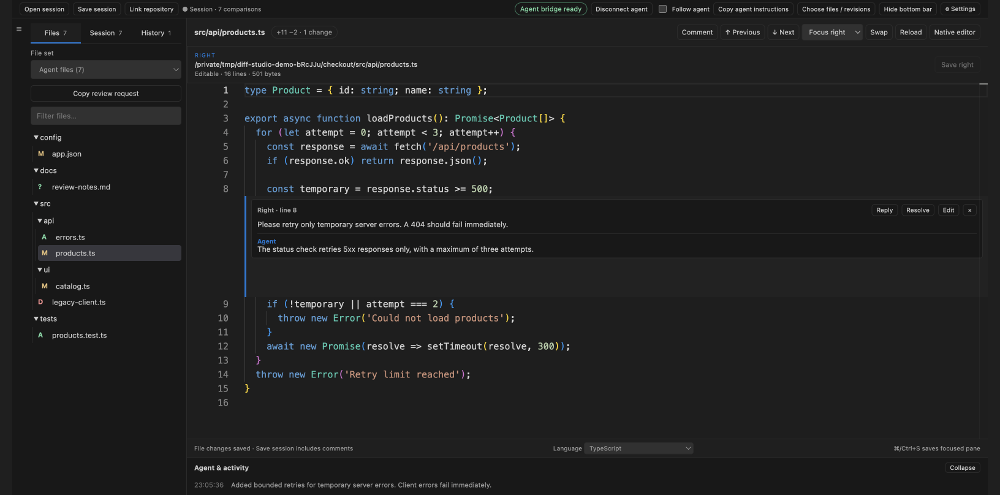
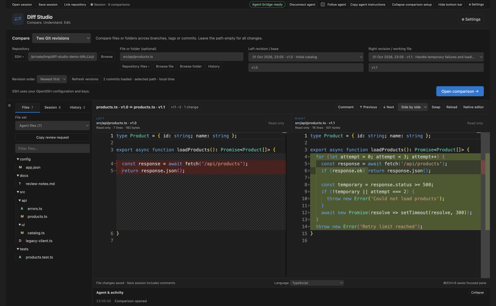
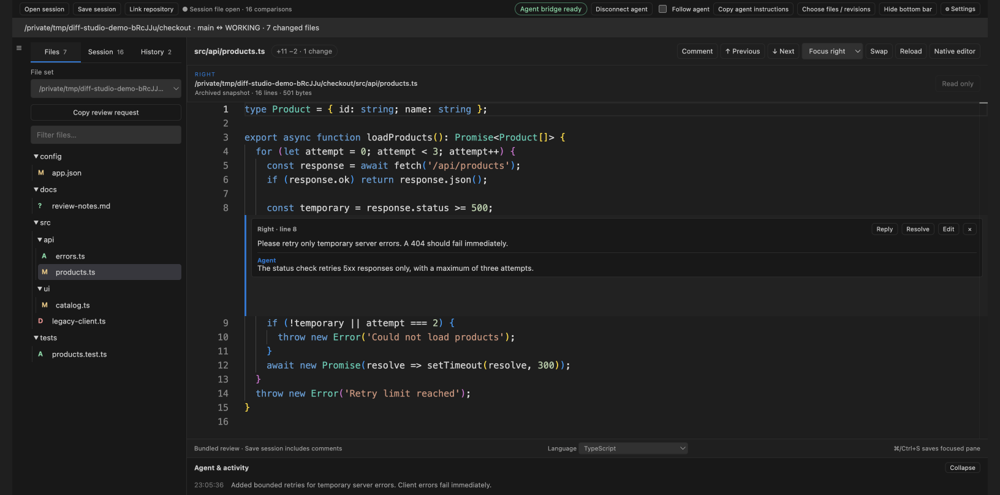

# Diff Studio

**Built for coding agents. Designed for you to review every change.**

Diff Studio gives you and your coding agent a shared place to compare files, preview edits, discuss individual lines, and revisit a whole project's changes inside VS Code. Connect an agent, give it your task, and keep the resulting comparisons in a browsable file tree while you review at your own pace.

Use it alongside Codex or another agent that can run local commands. It also works as a standalone diff editor for local files, Git history, folders, and SSH machines.



*An example catalog project: browse added, modified, deleted, and untracked files while comparing the selected file with its Git baseline. Screenshots show the actual extension with sample data.*

## What you can do

- **Review an agent's whole project.** Publish a changed-file tree at once, or accumulate comparisons as the agent opens individual files. Return to any comparison through **Files → File set → Agent files**.
- **Control what you are looking at.** Select a file to pause **Follow agent**. Background agent edits can continue while you inspect your chosen file.
- **Discuss code in place.** Add comments on either side, read agent replies, resolve completed requests, and reopen a discussion.
- **Edit inside the diff.** Change and save the working file in Git comparisons, or edit both sides when comparing two writable files.
- **Choose the right view.** Switch between side-by-side, inline, focus-left, and focus-right layouts, with syntax coloring and change navigation.
- **Compare across machines.** Browse local or SSH sources independently, including two different remote machines.
- **Take a review with you.** Save a `.diff_studio` session containing compared text, file trees, edits, and comment threads. Reopen it without the original repository.

## Start a comparison

1. Install **Diff Studio** and open the **Diff Studio icon** in VS Code's Activity Bar. You can also run **Diff Studio: Open Comparison Studio** from the command palette.
2. Choose **Two files**, **Two folders**, **Revision ↔ working file**, **Two Git revisions**, or **Changes against branch**.
3. Browse your sources. For a Git project, leave **File or folder** empty to list all changed files, or select a particular file or folder.
4. Click **Open comparison**. Select files in the tree and use **Previous / Next** to move between changes.
5. Edit a writable pane and click **Save left / Save right**, or press **Cmd/Ctrl+S** in the focused pane.

Comparison setup collapses after a successful open. **Choose files / revisions** brings it back. Existing OpenSSH configuration and keys are used for remote sources.

## Work alongside a coding agent

### 1. Connect and copy the instructions

Click **Connect agent**, then **Copy agent instructions**. Paste the complete handoff into your agent session together with your task.

The handoff includes the connection details, installed command-line script, current workspace context, and the complete bundled Diff Studio skill. The agent does not need to clone this repository or install the skill separately. It needs Node.js 18+ and access to the machine running the VS Code extension host.

For example, after pasting the handoff:

> Review this project against `main`. Show all changed files in Diff Studio as one project tree. Explain the risky changes, preserve my existing edits, and do not modify files yet.

### 2. Preview the work and keep your place

Ask the agent to show a comparison before changing a file, publish a whole project review, or add comparisons one by one. The files stay available in **Agent files**, independently of the recent-history limit. Reopening the same source pair preserves its existing buffers and comments.

> Add bounded retries to the product API client. Preserve the original code on the left and preview your edits on the right. Keep every touched file in Diff Studio and explain each change. Wait for my review before saving.

Choose any file to pause **Follow agent**, or uncheck it yourself. Re-enable it when you want to follow subsequent agent operations. An explicit agent `reveal` command can still select a file; the bundled instructions tell agents to reserve it for a requested view or a relevant handoff.

Agent buffer edits are previews until saved. An agent can also save through the bridge when your task authorizes it; follow your preferred review instructions when assigning work.

### 3. Comment, request a fix, and review the reply

Hover next to a line number and click **+**, or select a line and click **Comment**. Comments work on both sides and in every layout. Use **Reply**, **Resolve**, or **Reopen** to keep the discussion attached to the code.



*Ask about a specific condition, read the agent's reply, and keep the thread with the comparison.*

When your comments are ready, click **Copy review request** in the Files tab and paste it into the agent session. You can add instructions such as:

> Read all unresolved comments in Diff Studio. Fix the retry behavior, add tests for 404 and 503 responses, and reply to each thread with what changed and what you verified. Resolve only the requests you have completed.

The agent can read comments, reply in the same threads, edit the existing comparisons, and resolve verified fixes. Your original comments remain visible. If edits move a line, its comment moves with it; changed or deleted anchors retain their original text and are marked for review.

**Connect agent does not start an AI model, and adding a comment does not notify an agent automatically.** Paste the review request or ask your running agent to check comments. Reconnect and copy fresh instructions after reloading VS Code or restarting the bridge.

## Practical examples

### Review everything changed against a branch

Choose **Changes against branch**, browse the repository, and pick `main`, `master`, or another base from the version dropdown. Include working, staged, and untracked changes, or narrow the view to committed or staged changes. Enable **Compare from common ancestor** for a branch review based on the merge base.

Agent prompt:

> Show the whole project against `main` in Diff Studio. Keep a browsable tree, including new and deleted files. Let me navigate without switching files after every edit.

### Find a regression between two releases

Choose **Two Git revisions**, select your repository and file, then choose a branch, tag, or commit for each side. The dropdowns include commit dates, can be sorted newest or oldest first, and can load older history. Leave the file field empty to compare the whole repository at those revisions.



*Compare release tags, branches, or commit SHAs. Historical revision panes are read-only.*

Agent prompt:

> Compare `v1.0` and `v1.1` for the catalog code. Show the changed files in Diff Studio and add comments explaining changes that could affect error handling. Do not edit the working tree.

### Preview a refactor before saving

Compare `HEAD` with a working file, or ask the agent to preserve the original contents as a text snapshot. Review the proposed buffer and make your own edits in the writable pane.

> Refactor this function without changing its behavior. Show the original and proposed code in Diff Studio. Explain the intended change in the activity panel, and leave the proposal unsaved until I review it.

### Compare configuration across machines

Choose **Two files**. Use **SSH ▾** for either side, connect using an SSH alias or `user@host:port`, and browse to the file. Each side can use a different machine.

Example sources:

```text
Left:  /home/alex/project/config/app.json
Right: ssh://staging/home/deploy/project/config/app.json
```

For two servers:

```text
Left:  ssh://staging/etc/catalog/app.json
Right: ssh://production/etc/catalog/app.json
```

Agent prompt:

> Compare my local configuration with staging. Show the differences and explain them. Do not save anything to the remote machine.

Both file panes are writable when the sources support it. Saving is explicit. SSH requires an existing non-interactive OpenSSH connection and Python 3 on the remote host; remote Git comparisons also require Git.

### Compare two folders without Git

Choose **Two folders**, browse the original and updated directories, and open the changed-file tree. Identical files are omitted. Use this for generated output, configuration migrations, or a before-and-after copy of a project. Local/remote and remote/remote folder pairs are supported too.

> Compare `/home/alex/export-before` with `/home/alex/export-after`. Publish the folder tree in Diff Studio and explain the changed JSON fields. Leave the files unchanged.

### Share a review without sharing a repository

Click **Save session** to create a `.diff_studio` file. It captures supported file contents from both sides, current edits, compared groups, source metadata, activity, comments, replies, and resolution states. Captured folder and branch comparisons include supported files you have not clicked.

Send that file to a teammate. They choose **Open session → Review bundled snapshots** and can browse the comparisons and add comments without your repository, commit history, or SSH access.



*The reopened session retains its file tree and discussion. Bundled snapshots are read-only; comments can still be added and saved.*

If a matching local repository is available, **Link repository** can reconnect matching working files. Unmatched commits or contents remain available as bundled snapshots.

**Save session saves the review, not edits into the original files.** Use pane save controls for file changes. Open comparisons persist while the extension host runs; save a session before closing or reloading VS Code to carry them into another run. A session includes full compared text, so choose what you share accordingly.

## Comparison and editing guide

| Compare | Left side | Right side |
| --- | --- | --- |
| Two files, local or SSH | Editable file | Editable file |
| Two folders | Selected original file | Selected updated file |
| Git revision ↔ working file | Read-only revision | Editable working file |
| Two Git revisions | Read-only revision | Read-only revision |
| Branch ↔ working tree | Read-only baseline | Editable working file |
| Agent text snapshot ↔ file | Read-only snapshot | Editable file |
| Saved session without a linked repository | Read-only snapshot | Read-only snapshot |

File additions, deletions, renames, and untracked files appear in Git trees. A missing working file can be recreated by saving its writable pane. Binary, unsupported-encoding, or unreadable entries stay in the tree with an explanation; they do not prevent supported text files from opening.

## Make room for your review

- Drag the file list's right edge to resize it. Click **☰** to toggle auto-hide, then hover to reveal it.
- Use **Files** for comparison trees, **Session** for all retained comparisons, and **History** for recent opens. Set the history limit in Settings; remove individual entries with **×**.
- Choose **Side by side**, **Inline**, **Focus left**, or **Focus right**. Use **Swap** to exchange the sources.
- Open **Settings** for font size, wrapping, whitespace handling, unchanged-line folding, sidebar behavior, and file-size limits.
- Hide comparison setup and the bottom bar when you need more editor space. The compact toolbar keeps session, agent, and Settings controls accessible.

Monaco supplies syntax highlighting and built-in JavaScript, TypeScript, and JSON language support. Arbitrary VS Code language extensions do not run inside the embedded editor.

## Script the agent workflow

The copied handoff gives your agent the exact installed CLI and bridge paths. For manual scripting, substitute those paths below. These shell examples use POSIX syntax; the copied startup command adapts to the extension host platform.

```sh
export DIFF_STUDIO_BRIDGE='/path/from/handoff/agent.bridge.json'
CLI='/path/from/handoff/scripts/agent.mjs'

# Publish whole changed-file trees.
node "$CLI" project /home/alex/catalog main WORKING
node "$CLI" project /home/alex/catalog v1.0 v1.1
node "$CLI" folders /home/alex/before /home/alex/after

# Or accumulate individual comparisons.
node "$CLI" git /home/alex/catalog src/api/products.ts HEAD
node "$CLI" open /home/alex/before.ts /home/alex/current.ts
node "$CLI" groups
node "$CLI" list
```

Use session and comment IDs returned by `list` and `comments`:

```sh
# Explain and preview an edit without writing to disk.
node "$CLI" note SESSION_ID 'Limit retries to temporary server errors.'
node "$CLI" edit SESSION_ID right /home/alex/proposed.ts 'Add bounded retries.'

# Read feedback and reply within the existing thread.
node "$CLI" comments SESSION_ID
node "$CLI" reply SESSION_ID COMMENT_ID 'The condition now excludes client errors.'

# Save when authorized; resolve after verifying the requested fix.
node "$CLI" save SESSION_ID right
node "$CLI" resolve SESSION_ID COMMENT_ID
```

The bridge operates on the extension host machine and displays the comparisons, explanations, and edits an agent explicitly sends. It does not capture hidden reasoning or every keystroke. Diff Studio does not require a model API key; your agent runs separately. Concurrent buffer edits and externally changed files are checked before overwrite. See the [detailed reference](docs/REFERENCE.md) and [bundled agent skill](skills/diff-studio/SKILL.md) for more examples, snapshot requests, connection details, and recovery behavior.

## Requirements and scope

VS Code **1.100 or newer**. Agent scripts require **Node.js 18+**. Git comparisons require Git. In a Remote SSH window, local paths refer to the remote extension host; use a local VS Code window to compare laptop files with `ssh://` sources.

Diff Studio compares UTF-8 text, with a default file limit of 10 MB that can be changed in Settings. It supports BOM, Unicode, CRLF, and empty files. It is a two-way text comparison tool; it does not provide three-way merge resolution, image/binary diffs, or semantic AST comparison. Unavailable file contents are not bundled in saved sessions; their paths and reasons are retained.

## Source, support, and development

[Source on GitHub](https://github.com/N7K5/Diff_Studio) · [Report an issue](https://github.com/N7K5/Diff_Studio/issues) · [Changelog](CHANGELOG.md) · [Detailed reference](docs/REFERENCE.md)

```sh
npm ci
npm test
npm run test:vscode
mkdir -p artifacts
npm run package
code --install-extension artifacts/diff-studio.vsix
```

Open the checkout in VS Code and press **F5** to develop the extension. Tests use disposable fixtures and an isolated VS Code profile. See [TESTING.md](TESTING.md) for coverage and environment details. Licensed under [MIT](LICENSE).
